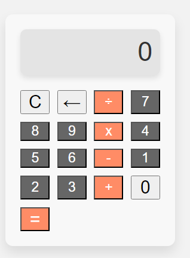

# Simple Calculator

A simple calculator web application built with HTML, CSS, and JavaScript.

## Overview

This is a basic calculator that allows users to perform simple arithmetic calculations. It includes addition, subtraction, multiplication, and division operations. The calculator has a user-friendly interface and is designed to work on both desktop and mobile devices.

## Features

- Addition, subtraction, multiplication, and division operations
- Clear button to reset the calculator
- Back button to delete the last entered digit
- Responsive design for desktop and mobile devices
- Elegant and user-friendly interface

## Getting Started

### Prerequisites

To run the calculator locally, you need a web browser.

### Installation

1. Clone the repository:

git clone https://github.com/Dr-Hachami/simple-calculator.git

2. Open the `index.html` file in your web browser.

## Usage

- Click on the number buttons to enter digits.
- Click on the operator buttons (+, -, x, ÷) to select the desired operation.
- Click on the "=" button to perform the calculation.
- Click on the "C" button to clear the calculator.
- Click on the "←" button to delete the last entered digit.

## Contributing

Contributions are welcome! If you find any issues or want to add new features, feel free to open a pull request.

## License

This project is licensed under the [MIT License](LICENSE).

## Acknowledgments

- Inspiration for this project came from various online resources and tutorials.

